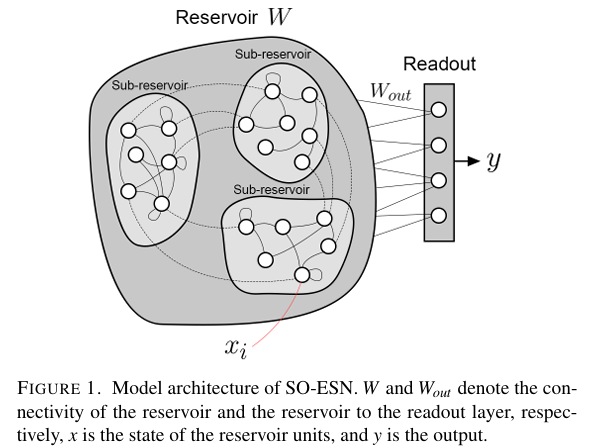

# Self-Oscillatory-Echo-State-Network
A PyTorch version of the Self-Oscillatory Echo State Network (SO-ESN). SO-ESN generates oscillations to reproduce desired waveforms. The reproduced waveforms are identical to reproducing CPG motor patterns, which can be applied to the actuators of a robotic system to create rhythmic movement.

# How to run
Just paste the code to your PyCharm and run... 

# Framework
The picture is taken from paper "Foong T Y, Vargas D V. Generating oscillation activity with echo state network to mimic the behavior of a simple central pattern generator[J]. arXiv preprint arXiv:2306.10927, 2023.".

# Results

